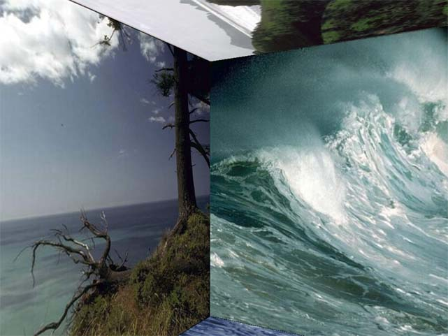



## \_\_\_\_Custom3D\_ScreenSaver\_Diretcx8\_

### Description

This is a cool directx 8.0 screensaver, it is a 3D room in which the user can create her/his own walls, floor and roof from any bitmap. This is my 3rd entry and first in directx. hope u like it.

i'm not compelling to vote 4 me but please do not forget to submit a comment pleasee....
 
### More Info
 
Requires Directx8.0

Windows XP for faster rendering

or windows 9x.(slow)

DO NOT USE LARGE SIZE BITMAPS IF U DONT HAVE A GOOD GRAPHICS SUPPORT.

             |
---                |---
**Submitted On**   |2005-01-30 11:09:02
**By**             |[Arun P \{:\-\)](https://github.com/Planet-Source-Code/PSCIndex/blob/master/ByAuthor/arun-p.md)
**Level**          |Intermediate
**User Rating**    |4.9 (39 globes from 8 users)
**Compatibility**  |VB 6\.0
**Category**       |[DirectX](https://github.com/Planet-Source-Code/PSCIndex/blob/master/ByCategory/directx__1-44.md)
**World**          |[Visual Basic](https://github.com/Planet-Source-Code/PSCIndex/blob/master/ByWorld/visual-basic.md)
**Archive File**   |[\_\_\_\_Custom1845661302005\.zip](https://github.com/Planet-Source-Code/arun-p-custom3d-screensaver-diretcx8__1-58566/archive/master.zip)

